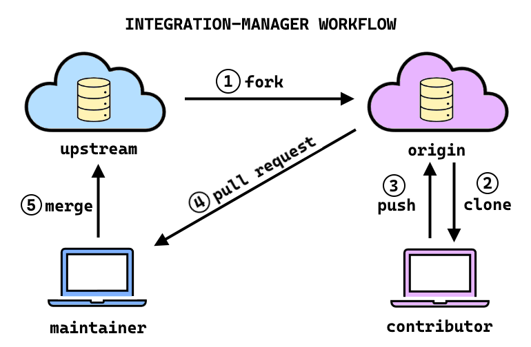

# Contributing 🎉

Thank you for your interest! We welcome contributions and strive to foster a collaborative environment where users like you can help make this library stronger. Please note that this package is maintained by volunteers who give selflessly of their time, so please [be respectful](#being-respectful) when working on this project.

To maintain consistency across the code base and minimize the introduction of bugs, we follow several guidelines during development. Every effort has been made to automate this for you using several tools so you can focus on adding features rather than fixing semicolons 😆. This page will show you how to use these tools and what rules to follow when contributing to the code, so please read the following sections very carefully.

Happy coding!

## General Guidelines

### Being Respectful

First and foremost, all contributors shall demonstrate empathy and kindness towards each other. This project respects all skill levels and aims to foster an environment where people want to contribute. Please do not talk down or belittle others or their work. For more info, please read the [Code of Conduct][code-of-conduct].

### Branching Strategy

This project uses [Trunk-Based Development][trunk-based-development]:

- `main` is the development branch: all branches (except `release`) emanate from and merge back into here.
- `release` contains stable versions of the codebase, as mirrored on [PyPI][pypi]. This is the only long-lived branch.

All commits in pull requests rebased onto the tip of `main` and squash merged (see [FAQ][faq-why-rebase-and-squash-merge]).

### Project Workflow

To make a contribution to the project, please use the [Integration-Manager Workflow][integration-manager-workflow]:

1. Fork the main repository
1. Clone the fork to your local machine and create a branch corresponding to the type of change being made.

   :::{note}
   :name: branch-naming-convention

   Name the branch per the [Branch Naming Convention](#branch-naming-convention)
   :::

1. Create your changes on the branch and push them back up to the fork.

   :::{note}
   :name: project-setup

   Refer to [Project Setup](#project-setup) for instructions on how to set up your editor to properly handle linting, testing, pre-commit checks, etc., or to use [GitHub Codespaces][codespaces].
   :::

1. Create a pull request (PR), which will signal maintainers to perform a code review

1. Once the PR has successfully passed all checks and code review, maintainers will merge the changes into the codebase.



### Branch Naming Convention

When creating a pull request, please use one of the following prefixes for the name of your branch corresponding to the type of change being made:

- `fix/`: for any bug fixes on the `main` branch
- `feat/`: for any new features or additions to the code
- `ci/`: for any changes to CI routines
- `maint/`: for any general maintenance of the repository
- `doc/`: for any changes only pertaining to documentation
- `test/`: for any changes only pertaining to tests
- `release/`: for a new release
- `hotfix/`: for a fix to an existing release

### Project Setup

Todo later

### Versioning Strategy

This project uses a `0ver`-ish style of versioning consistent with `PEP 440`. In the [words of Brett Cannon][why-i-dont-like-semver], "*version numbers are just a mapping of a sequence of digits to our branching strategy in source control*". By [Hyrum's Law][hyrums-law], it is impossible to know *a priori* what will break a system, which is why semantic versioning doesn't make much sense.

Instead, version numbers in this project roughly equate to how long a certain state of the code will live and what degree of maintenance it will receive:

- When a certain state of the project is deemed ready to be published for long-term public use, a pull request will be made on the `release` branch to create what is called a release candidate.
- After being thoroughly tested and reviewed, the branch will be tagged with a `minor` version number (e.g. `0.1.0`) and merged into the `release` branch
- No other changes will be made to that release except to fix bugs, which are called `hot fix` pull request. When a `hot fix` is made to a release, the `patch` number of the version tag will be updated (e.g. `0.1.1`)
- A GitHub release will be made on the project repository corresponding to this release, including a changelog
- All releases of the codebase should be kept for the lifetime of the project. However, support for different releases (i.e. maintenance) and creation of new releases will follow a regular `release schedule` as deemed appropriate, wherein certain versions will be `sunset` and/or different features will be `deprecated`.

## Testing

`tox` is used to test code. To use `uv` virtual environments with `tox`, install `tox-uv` as a tool:

```bash
uv tool install tox --with tox-uv --force-reinstall
```

To run tests, execute the following:

```bash
uvx tox
```

which internally runs

```bash
coverage run -m pytest
```

for all Python versions this package supports.

### Becoming a Maintainer

If you feel you can triage problems and mentor junior developers, please consider becoming a maintainer!

[code-of-conduct]: code_of_conduct.md
[trunk-based-development]: https://trunkbaseddevelopment.com/
[pypi]: https://pypi.org/
[faq-why-rebase-and-squash-merge]: faq.md#why-rebase-and-squash-merge
[integration-manager-workflow]: https://git-scm.com/book/en/v2/Distributed-Git-Distributed-Workflows
[codespaces]: https://github.com/features/codespaces
[why-i-dont-like-semver]: https://snarky.ca/why-i-dont-like-semver/
[hyrums-law]: https://www.hyrumslaw.com/
